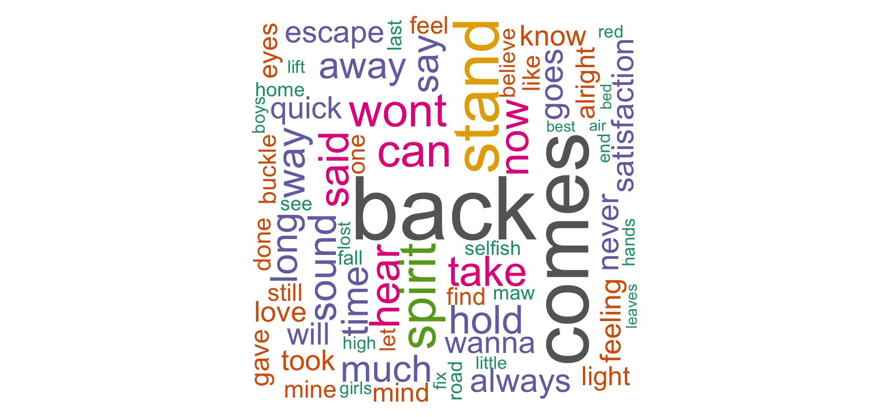

```{r , include=F}
# pj <- readRDS(file = 'Data/pearl.RDS')
pj <- readRDS(file = 'Data/pearl jam 2.RDS')
rows <- sample(nrow(pj))
pj <- pj[rows,]
```

## Musical and lyrical analysis of Pearl Jam's songs

This repository comprises a musical and lyrical analysis of Pearl Jam's songs. I use data from Spotify's and Genius's APIs. I use scripts to query information on the musical propety of all of the 11 Pearl Jam albums. I later use a script to scrape the lyrycs to several songs and finally use the Genius API to download the remaining. Related works include [Kendrick Lamar sentiment analysis](https://github.com/davidklaing/kendrick/blob/master/README.md), [Gloom Index](https://www.rcharlie.com/blog/fitter-happier/) to find Radiohead's most depressing song by [Charlie Thompson](https://www.rcharlie.com), [Bob Dylan lyrical analysis](https://rpubs.com/paul_reiners/406359) by Paul Reiners, [tidy sentiment analysis](https://www.datacamp.com/community/tutorials/sentiment-analysis-R) on Prince's music by Debbie Liske and [Musical Lyrics Analysis](https://rpubs.com/BreeMcLennan/music_lyric_analysis) on several artists by Bree McLennan.

The repo is organized as follows:


* **Data Assessment**
  + **Intellectual Property (Copyrigths)**
  + **Songs selection: Spotify API**
  + **Lyrics: Genius API**

* **Data exploration**
  + **Tokens & data wrangling**
  + **Gloom Index**
  + **Word counts by album and song**
  + **Wordclouds**
  + **Vocabulary diversity**
  + **Term Frequency Inverse Document Frequency (TF-IDF)**

* **Sentiment Analysis and Natural Language Processing**
  + **NCR Sentiment**
  + **Bi-grams and tri-grams**
  
# Data Assessment
## Intellectual Property (Copyrigths)

I would like to acknowledge that every single content exposed in this repository is based on protected songs. All the rigths of the data used come from the Spotify API, Genius API, but mainly the sonwriters and composers of the songs. In no way it is intented to make it as my own. All the mistakes made are my own and no one else.

## Songs selection: Spotify API

I first asing all the packages needed into the vector `packages`. In this section the important package to query the Spotify API is `spotifyr`.

```{r, eval=T ,include=F}
packages <- c('spotifyr','lubridate','ggplot2','dplyr','tidytext','stringr','tidyr','viridis','wordcloud', "tm",'forcats','fmsb','scales','radarchart','qdap','knitr','geniusr','tidyverse','plotly')
lapply(packages,require,character.only=T)
rm(packages)
```

```{r, eval=F ,include=T}
packages <- c('spotifyr','lubridate','ggplot2','dplyr','tidytext','stringr','tidyr','viridis','wordcloud', "tm",'forcats','fmsb','scales','radarchart','qdap','knitr','geniusr','tidyverse','plotly')
lapply(packages,require,character.only=T)
rm(packages)
```
The package requieres a `Client ID` and a `Client Secret` to query the API. To do so, the user must have a premium account in order to create a developers account. The proccess could be done [here](https://developer.spotify.com/dashboard/). Once this process is done, you can pull spotify access token into R with `get_spotify_access_token()`. Note that you could pass your ID and secret in order to set your credentials into System Environment. For more information on the packages reference to Charlie Thompson's `spotifyr` Github [repository](https://github.com/charlie86/spotifyr).

```{r, eval=F}
Sys.setenv(SPOTIFY_CLIENT_ID = 'xxxxxxxxxxxxxxxxxxxxx')
Sys.setenv(SPOTIFY_CLIENT_SECRET = 'xxxxxxxxxxxxxxxxxxxxx')

access_token <- get_spotify_access_token()
```

To get Pearl Jam's songs audio features we use the function `get_artist_audio_features()`. This functions queries the Spotify API and returns information on several characteristics such as: danceability, energy, instrumentalness, valene, explicit content, track name, track album, etc. Now, I'll only keep songs featuring in the 11 albums. The reason is to eliminate live performances and covers and focus on self-written songs. Lastly we verify there are no repeated sing in the data set.

```{r, eval=T}
albums <- c("Riot Act", "Ten", "Yield", "Gigaton", "Backspacer", "Vs.", "Pearl Jam", "No Code", "Vitalogy", "Binaural", "Lightning Bolt")
pj <- pj[pj$album_name %in% albums,]
pj <- mutate(pj, dupli=ifelse(duplicated(pj$track_name)==T,1,0))
pj <- subset(pj,dupli == 0)
head(pj,5) %>% select(track_name, album_name,artist_name,album_release_date,danceability,instrumentalness,energy,valence, key_name,mode_name) %>%  kable(format = "simple", col.names = str_to_title(gsub("[_]", " ", colnames(.))),align = 'lccccccccc',caption = "An example table caption.",digits = 3)
```

## Lyrics: Genius API

As for Spotify's API, the Genius API requieres a developers account in order to query information. To authenticate the information the user must: 1. Create a `Genius API client` [here](https://genius.com/api-clients/new), 2. generate a `client access token` form the [API Clients Page](https://genius.com/api-clients) and 3. set your credential in the System environment variable `GENIUS_API_TOKE` calling the function `genius_token()`. Now, in order to fecth the lyrics for each song I created a loop that goes trhough every song in the data set and retrieves the lyrics in a single vector and then adds it to the create variable `lyrics2`.

```{r, eval = F} 
pj <- mutate(pj, lyrics2 = "")
for (element in (1:nrow(pj))) {
  
  # I created the loop with two cicles in it in order to double check all the songs 
  # get their corresponding lyrics. Note that the loop isolates each song and
  # retrieves the information with the function et_lyrics_search()
  
  title <- str_to_title(pj$track_name[element]) 
  print(title)
  lyrics <- get_lyrics_search(artist_name = "Pearl Jam",
                              song_title = title)
  if (nrow(lyrics)!=0) {
    # I optedto reduce the dimensions of the retrieved data set to  one observation.
    # Now I save the first line and add the rest of the lines of the song
  lyrics2 <- ""
    for (piece in (1:nrow(lyrics))) {
    if (piece ==1) {
      lyrics2 <- lyrics$line[piece]
    }
    else{
      lyrics2 <- paste(lyrics2, lyrics$line[piece], collapse = " ")
    }
    print(title)
    print(lyrics2)
    }
  }
  
  # If any song had any problem with querying the lyrics the second part of the loop
  # repeats the procces to guarantee that all songs are assinged to their lyrics.
  
  if (nrow(lyrics)==0) {
    lyrics <- get_lyrics_search(artist_name = "Pearl Jam",
                                song_title = title)
    lyrics2 <- ""
    for (piece in (1:nrow(lyrics))) {
      if (piece ==1) {
        lyrics2 <- lyrics$line[piece]
      }
      else{
        lyrics2 <- paste(lyrics2, lyrics$line[piece], collapse = " ")
      }
      print(title)
      print(lyrics2)
    }
  }
  
  # Finally the song is added to the original data
  
  pj$lyrics2[element] <- lyrics2
}
```

Our data set now contains lyrics to all the 146 songs in the 11 albums. A glimpse to my top two Pearl Jam songs (according to spotify rankings) Black and Even flow:

``` {r, eval=T ,include=F} 
pj$track_name <- str_to_title(pj$track_name)
```

``` {r}
songs <- c('Black', 'Even Flow')
pj[pj$track_name %in% songs,] %>% select(artist_name, album_name, track_name, lyrics) %>% 
  kable(format = "simple",col.names = str_to_title(gsub("[_]", " ", colnames(.))),align = 'lccccccccc')
```

Finally, we have to take into account instumental songs. Even though Pearl Jam doesn't have many instrumental songs 3 cases need to be adressed. these are **Arc**, **Aya Davanita** and **Cready Stomp**. I proced then to assing a missing value to these songs in order to implement the followong analysis.
``` {r, eval = T}
songs <- c("Arc","Aya Davanita - Remastered","Cready Stomp - Bonus Track")
pj[pj$track_name %in% songs,grep('lyrics', colnames(pj))]
pj[pj$track_name %in% songs,grep('lyrics', colnames(pj))] <- NA
```

# Data exploration
## Tokens & data wrangling

The dataset is almost ready for use. I now execute some few data wrangling steps in order to have all the information needed. I use the package `tm` in order to remove punctuation, stop words and stemming. I begin by compiling all lyrics and create a corpus using the function `VectorSource` to read it a s a document and then pass the documents through the `Corpus` to create the final corpus. Note that all the document transformation of the document are done through the funciton `tm_map`, applying a function to all elements of the document. The process I follow is: **1)** transform all upper-case letter to lower-case; **2)** remove all punctionation; **3)** remove English stop words; and **4)** stem all the white spaces.

``` {r, eval=T,include = F}
lyrics <- Corpus(VectorSource(pj$lyrics))
lyrics <- tm_map(lyrics, content_transformer(tolower))
lyrics <- tm_map(lyrics, removePunctuation)
lyrics <- tm_map(lyrics, removeWords, stopwords("english"))
lyrics <- tm_map(lyrics, stripWhitespace)
lyrics <- lyrics %>% unlist()
pj$lyrics <- as.character(lyrics[1:nrow(pj)])
pj$lyrics <- str_trim(pj$lyrics)

```

``` {r, eval=F,include = T}
lyrics <- Corpus(VectorSource(pj$lyrics))
lyrics <- tm_map(lyrics, content_transformer(tolower))
lyrics <- tm_map(lyrics, removePunctuation)
lyrics <- tm_map(lyrics, removeWords, stopwords("english"))
lyrics <- tm_map(lyrics, stripWhitespace)
lyrics <- lyrics %>% unlist()
pj$lyrics <- as.character(lyrics[1:nrow(pj)])
pj$lyrics <- str_trim(pj$lyrics)

```

After procesing the lyrics there's still some special cases that need to be taken into account ir order to prevent bias in the results. First, word contractions need to be addressed. As I removed all punctuation before, some contractions such as **she's** will be now **shes** and are not taken as stop words by the function `tm_map`. Other cases are rythmitic vocals. Take Black as an example. The last minute of the song Eddie goes on like **doo doo doo doo doo doo doo**. In order to prevent biased results I ommit all rythmitic vocals and replace the contractions by their respective joint words.

``` {r, eval = T}

pj$lyrics <- str_replace_all(pj$lyrics, 'bottomoh', ' bottom oh ')
pj$lyrics <- str_replace_all(pj$lyrics, ' heyim ', ' hey I am ')
pj$lyrics <- str_replace_all(pj$lyrics, ' deepoh ', ' deep oh ')
pj$lyrics <- str_replace_all(pj$lyrics, ' butterfliesdont ', ' butterflies do not ')
pj$lyrics <- str_replace_all(pj$lyrics, ' awaysomeday ', ' away someday ')
pj$lyrics <- str_replace_all(pj$lyrics, ' risingnext ', ' rising next ')
pj$lyrics <- str_replace_all(pj$lyrics, ' uhohoh ', ' oh ')
pj$lyrics <- str_replace_all(pj$lyrics, ' angellest ', ' angel lets ')
pj$lyrics <- str_replace_all(pj$lyrics, ' doodoodoodoodoodoodoo ', '')
pj$lyrics <- str_replace_all(pj$lyrics, ' yeah ', ' ')
pj$lyrics <- str_replace_all(pj$lyrics, ' yeah', ' ')
pj$lyrics <- str_replace_all(pj$lyrics, ' ooh ', ' ')
pj$lyrics <- str_replace_all(pj$lyrics, ' oh ', ' ')
pj$lyrics <- str_replace_all(pj$lyrics, ' ah ', ' ')
pj$lyrics <- str_replace_all(pj$lyrics, ' hm ', ' ')
pj$lyrics <- str_replace_all(pj$lyrics, ' ye ', ' ')
pj$lyrics <- str_replace_all(pj$lyrics, ' ay ', ' ')
pj$lyrics <- str_replace_all(pj$lyrics, ' yeh ', ' ')
pj$lyrics <- str_replace_all(pj$lyrics, ' ya ', 'you')
pj$lyrics <- str_replace_all(pj$lyrics, ' mm ', ' ')
pj$lyrics <- str_replace_all(pj$lyrics, ' interlude ', ' ')
pj$lyrics <- str_replace_all(pj$lyrics, ' woo ', ' ')
pj$lyrics <- str_replace_all(pj$lyrics, ' mhm ', ' ')
pj$lyrics <- str_replace_all(pj$lyrics, ' oooh ', ' ')
pj$lyrics <- str_replace_all(pj$lyrics, ' ooooh ', ' ')
pj$lyrics <- str_replace_all(pj$lyrics, ' hey ', ' ')
pj$lyrics <- str_replace_all(pj$lyrics, ' uh ', ' ')
pj$lyrics <- str_replace_all(pj$lyrics, ' youll ', ' you will ')
pj$lyrics <- str_replace_all(pj$lyrics, ' cant ', ' can not ')
pj$lyrics <- str_replace_all(pj$lyrics, 'cant ', ' can not ')
pj$lyrics <- str_replace_all(pj$lyrics, ' im ', ' I am ')
pj$lyrics <- str_replace_all(pj$lyrics, ' ill ', ' I will ')
pj$lyrics <- str_replace_all(pj$lyrics, ' didnt ', ' did not ')
pj$lyrics <- str_replace_all(pj$lyrics, ' dont ', ' do not ')
pj$lyrics <- str_replace_all(pj$lyrics, ' hes ', ' he is ')
pj$lyrics <- str_replace_all(pj$lyrics, ' uhhuh ', '')
pj$lyrics <- str_replace_all(pj$lyrics, ' its' , '')
pj$lyrics <- str_replace_all(pj$lyrics, ' id ', ' I would ')
pj$lyrics <- str_replace_all(pj$lyrics, ' youre ', ' you are ')
pj$lyrics <- str_replace_all(pj$lyrics, ' youve ', ' you have ')
pj$lyrics <- str_replace_all(pj$lyrics, ' youd ', ' you would ')
pj$lyrics <- str_replace_all(pj$lyrics, ' theres ', ' there is ')
pj$lyrics <- str_replace_all(pj$lyrics, ' theyll ', ' they will ')
pj$lyrics <- str_replace_all(pj$lyrics, ' whats ', ' what is ')
pj$lyrics <- str_replace_all(pj$lyrics, ' doesnt ', ' does not ')
pj$lyrics <- str_replace_all(pj$lyrics, ' ive ', ' I have ')
pj$lyrics <- str_replace_all(pj$lyrics, ' hadnt ', ' had not ')
pj$lyrics <- str_replace_all(pj$lyrics, ' wouldnt ', ' would not ')
pj$lyrics <- str_replace_all(pj$lyrics, ' til ',' until ')
pj$lyrics <- str_replace_all(pj$lyrics, ' wouldve ', ' would have ')
pj$lyrics <- str_replace_all(pj$lyrics, ' shes ', ' she is ')
pj$lyrics <- str_replace_all(pj$lyrics, ' thats ', ' that is ')
```

One last step into our final dataset is word sentiment. I then turn the data into a tidy format using the package `tidytext`. I use the function `unnest_tokens` in order to split the lyrics into indivudual words. the function `get_sentiments` is usedto obtain the sentiments lexicon in a tidy format. The lexicon used is `NCR` **Word-Emotion Association Lexicon**. This lexicon lists English words and matches their associations with eight basic emotions (anger, fear, anticipation, trust, surprise, sadness, joy, and disgust) and two sentiments (negative and positive). Further information could be found in the official [web page](https://saifmohammad.com/WebPages/NRC-Emotion-Lexicon.htm). With the  sentiments matched I'm able to count the number of words per emotion and sentiment.
``` {r, eval =F, include = T}

pearl_songs <- pj %>% unnest_tokens(word, lyrics) # Separate the lyrics into single words
cleaned_pearl <- pearl_songs %>% anti_join(stop_words) # Eliminating stop words
nrc <- get_sentiments(lexicon = "nrc") # Categorical words sentiments

pearl_sentiment <- cleaned_pearl %>%
  inner_join(nrc,by = c('word')) %>% # Merging the word sentiment data with the words dataset
  count(track_name, sentiment) %>% # Counting the number of words per sentiment
  spread(sentiment, n, fill = 0) # Reshaping the data from observations into columns

columns <- c(grep('album_name', colnames(pj)),
             grep('track_name', colnames(pj)))

pearl_sentiment <- inner_join(x = pearl_sentiment, y = pj[,columns], by = "track_name")
pj <- inner_join(pj, pearl_sentiment)

```

``` {r, eval =T,include = F}

pearl_songs <- pj %>% unnest_tokens(word, lyrics)
cleaned_pearl <- pearl_songs %>% anti_join(stop_words)
nrc <- get_sentiments(lexicon = "nrc")
# 
pearl_sentiment <- cleaned_pearl %>%
  inner_join(nrc,by = c('word')) %>%
  count(track_name, sentiment) %>%
  spread(sentiment, n, fill = 0)

columns <- c(grep('album_name', colnames(pj)),
             grep('track_name', colnames(pj)))

pearl_sentiment <- inner_join(x = pearl_sentiment, y = pj[,columns], by = "track_name")
pj <- inner_join(pj, pearl_sentiment)

```

## Gloom Index

With the final dataset I'm able to do some sort of analysis to Pearl Jam's discography. At first hand I was interested in finding some metric of sadness in a musical context. One of the most interesting analysis taking this into account is the [Gloom Index](https://www.rcharlie.com/blog/fitter-happier/) developed by [Charlie Thompson](https://www.rcharlie.com). Here the author uses the information on the valence of the song, the percentage of sad songs and the lyrical density of the song. In terms of valence, Spotify uses a wide variety of inputs to determine weather a songs sound happy or not. With this in mind sad songs have a lower valence score and happy songs have high valence. Here's a preview of some of Pearl Jam's saddest songs according this measure:

```{r}
pj %>% group_by(track_name) %>% summarise(valence = mean(valence)) %>% arrange(valence) %>% head(10) %>% kable(format = "simple", col.names = str_to_title(gsub("[_]", " ", colnames(.))),align = 'lc',caption = "Top ten saddest Pearl Jam songs - Valence score",digits = 3)
```

Originally the index takes the following form:

$$Gloom\;Index = \frac{(1-valence) + percentage\_sad(1+lyrical\_density)}{2}$$
Now, noting that the lyrical density migth be misleading I turn to other measure of lyrical density. Longer songs might have more repeated lyrics than shorter songs. This can be either by more choruses or bridges, but the results might be wrong for this reason. Accounting for this problem a cleaner metric for lyrical density is the ratio of disticnt words and total words used.
$$Glomm\; Index = \frac{(1-valence)+percentage\_sad(1+distinct\_percentage)}{2}$$ 

Where

$$distinct\_percentage = \frac{\# distinct \;words}{\# total words}$$

Now, having this information how can this index be interpreted? We need to understand how gloom moves along the different inputs. First, valence shows higher values for happy songs whilst low values for sad songs. Now, by subtracting the valence, a song with lower valence will have a higher index score. In other words, valence has an inverse relationship with the gloom index. Now, turbulent words and distinct words percentage logically move in the same direction of the gloom index. I can now say that ***higher values show sadder songs, while lower values represent happier songs***. Note that compared to Charlie's [Radiohead analysis](https://www.rcharlie.com/blog/fitter-happier/) my index is interpreted in a completely different way. The main reason is because Charlie rescales his index in order to represent happy songs with higher values. Now, the interpretation of the results are analogous, the only difference are the scale in which they are presented.

```{r, eval = T}
pj <- pj %>% unnest_tokens(word, lyrics) %>%
  group_by(track_name) %>% summarise(distinct_words = n_distinct(word)) %>% 
  inner_join(pj)

pj <- mutate(pj, words = sapply(strsplit(pj$lyrics, " "), length))
pj <- mutate(pj, seconds = duration_ms/1000)
pj <- mutate(pj, words_per_second = words/seconds)
pj <- mutate(pj, sad_percentage = sadness/distinct_words)
pj <- mutate(pj, dist_per = (distinct_words/words))
pj <- mutate(pj, index = ((1-valence)+sad_percentage*(1+dist_per))/2)
```


I can now vizualize different information I have gathered along the document. First, we can see the saddest songs according to the Gloom Index. 


```{r, eval = T}
pj %>% group_by(track_name,album_name) %>% 
  summarise(index = mean(index),
            valence = mean(valence),
            `turbulent words` = mean(sad_percentage),
            `distinct percentage words` = mean(dist_per)) %>% arrange(desc(index)) %>% head(10) %>% kable(format = "simple", col.names = str_to_title(gsub("[_]", " ", colnames(.))),align = 'lccccc',caption = "Top ten saddest Pearl Jam songs - Gloom Index",digits = 3)
```

We have now the most depressing Pearl Jam song to date: **Spin the Black Circle**. But how can it be? Anyone who have heard the rigth ammount of their songs could argue in favor of Release or All those yesterdays, or even Black, but remember that this is a data driven measure. Spin the Black Circle actually has a rather low valence score (meaning is a sad song), ranking 19th with 0.141. But the percentage of sad words is the second highest of all songs, behind Red Bar (which repeats seven times) wih a percentage of sad word of 52%. If the ranking seems odd listen to the songs and see it for yourself.

To see how sadness or gloom has evolved across time, is posible to average the index per album and see the dynamic. This is the ranking for the saddest albums:

```{r, eval = T}
pj %>% group_by(album_name) %>% 
  summarise(index = mean(index),
            valence = mean(valence),
            `sad words` = mean(sad_percentage),
            `distinct percentage words` = mean(dist_per)) %>% arrange(desc(index)) %>% head(12) %>% kable(format = "simple", col.names = str_to_title(gsub("[_]", " ", colnames(.))),align = 'lccccc',caption = "Saddest Pearl Jam albums - Gloom Index",digits = 3)
```


```{r, include =F, eval =T}
rank <-  pj %>% group_by(album_name,track_name,album_release_year) %>% summarise(average = mean(index)) %>% arrange(album_release_year)
rank <-  inner_join(rank, rank %>% group_by(album_name) %>% summarise(gloom_index = mean(average)))
rank <- as.data.frame(rank)

album_levels <- c(
  "Ten", "Vs.", "Vitalogy", "No Code", "Yield", "Binaural", 
  "Riot Act", "Pearl Jam", "Backspacer", "Lightning Bolt", "Gigaton")

rank$album_name <- factor(rank$album_name, levels = album_levels)
pj$album_name <- factor(pj$album_name, levels = album_levels)

```

Now, it is posible to include both results from the last two tables in one graph in order to compare the results. Each point in the graph represents a songs, and for each song theres a gloom index score. The black dots represent the average score for each album. It is improtant to note that by the tim pearl jam songs seem to be growing less sad. 
```{r, eval = T,out.width="99%"}

pal <- c("turquoise4","navyblue","peru","goldenrod2","forestgreen","darkgray",
         "orange","magenta","lightslateblue","yellowgreen","mediumblue")

fig <- plot_ly(data = rank,
              x = ~album_name, y = ~average,type = 'scatter',mode = 'markers',
              marker = list(size = 10),
              color = ~album_name, colors = pal, span = I(1),stroke = I("black"),
              text = ~paste("Gloom Index score: ", round(average,3), '<br>Track:', track_name))

fig <- fig %>% add_trace(y = ~gloom_index,mode = 'lines+markers',type = 'scatter',name = 'Album Average',
                      color = I('black'),stroke = I("black"),marker = list(size = 10),
                      text = ~paste("Album average valence:", round(gloom_index,3),                                              '<br>Album:',album_name))

fig %>% layout(xaxis = list(zeroline = T, title ="Album Name"),
               yaxis = list(hoverformat = '.3f', title = 'Gloom Index'),
               showlegend = F)
```
With this graph we can conclude some things. First, the saddest Pearl Jam album to date is **Ten**, followed by **Yield** and **Vitalogy**. On the other hand, the happiest albums being  Backspacer and Lightning Bolt and the tops sad songs being **Parting ways** and **Supersonic**.

## Word counts by album and song

With the dataset I'm able to do some extra exploration. For example, how many words does each album have in average? How many words per second? What's the wordiest song and album? In order to answer this question is important to rely in an important word count statistic. For this matter i will use the count of distictive words used in the song. But, why this statistic? I considered distinct words in order to avoid reptetiveness. For example, in analizing Deep, you can hear about 7 times ***can't touch the bottom***. In doing so we are not being guided by the repetiveness of the song, but the different words used.

``` {r, eval = T}
pj %>% group_by(track_name,album_name) %>% summarise(distinct_words = mean(distinct_words),
                                                     word_per_song = mean(words),
                                                     words_per_second = mean(words_per_second)) %>%              arrange(desc(distinct_words)) %>% head(10) %>%
  kable(format = "simple", col.names = str_to_title(gsub("[_]", " ", colnames(.))),align = 'lcccc',caption = "Pearl Jam word count by song",digits = 3)
```

## Wordclouds

At this point I'am able to use the filtered data into wordclouds by using the  word counts for each song. By doing so the main objective is to vizualize the pricipal words used in each song by adding the total words used in each song across albums. I use the packages `wordcloud` and `tm`. I then follow to use the functions `wordcloud`(from `wordcloud`) and `DocumentTermMatrix`, `Corpus` and `VectorSource` (from `tm`). I plot the top 100 words selected by the word counts in each album (aggreated by the sum of each words count by song)

A small caveat in this section: Word counts do not account for song repetiiveness. So word usage might be biased in terms of repetition within each song and album. Section 2.6 (Term frequency Inverse Document Frequency (TF-IDF)) takes this problem into account by using a measure of the importance of each word in teach song.

--- 
Ten  
--- 
Ten  
--- 
Vs.  
--- 
Vitalogy  
--- 
No Code  
--- 
Yield  
--- 
Binaural  
--- 
Riot Act  
--- 
Pearl Jam  
--- 
Backspacer  
--- 
Lighthing Bolt  
--- 
Gigaton  
--- 

## Vocabulary diversity

``` {r,out.width="99%"}
pj %>% group_by(album_name,track_name) %>% summarise(number_words = mean(distinct_words)) %>% 
  ggplot(data = ., aes(x = factor(album_name),y = number_words)) +geom_violin(alpha = 0.7, color = 'black', size = 0.2)+
  geom_jitter(aes(size = number_words),height = 0, width = 0.1, alpha =0.2) + geom_boxplot(aes(fill = album_name), alpha = 0.6) +
  labs(title = "Lexical Diversity - Vocabulary", x = "", y = 'Distinct words count') + theme_bw() + 
  theme(plot.title = element_text(hjust = 0.5, size = 10),
        axis.title = element_text(size = 8),
        axis.text = element_text(size = 7),
        legend.title  = element_text(size = 8),
        legend.position = "bottom",
        panel.grid.major = element_line(size = 0.4)) + guides(fill = F) + scale_size('Number of words')

```

## Term Frequency Inverse Document Frequency (TF-IDF)

```{r,include=F,eval=T}
frequency <- pj %>% unnest_tokens(word, lyrics) %>% 
  count(album_name, word, sort = T) %>% bind_tf_idf(word, album_name, n)
frequency$album_name <- factor(frequency$album_name, levels = album_levels)

frequency <- subset(frequency,word != "e")
frequency <- subset(frequency,word != "g")
frequency <- subset(frequency,word != "re")
frequency <- subset(frequency,word != "r")
frequency <- subset(frequency,word != "ok")
frequency <- subset(frequency,word != "uhoh")
frequency <- subset(frequency,word != "ben")
frequency <- subset(frequency,word != "ha")
frequency <- subset(frequency,word != "ben")
frequency <- subset(frequency,word != "wah")
frequency <- subset(frequency,word != "woah")
frequency <- subset(frequency,word != "d")
```
```{r,out.width="99%"}

album_levels1 <- c("Ten", "Vs.", "Vitalogy", "No Code", "Yield", "Binaural")
album_levels2 <- c("Riot Act", "Pearl Jam", "Backspacer", "Lightning Bolt", "Gigaton")

frequency[frequency$album_name %in% album_levels1,] %>% group_by(album_name) %>% 
  slice_max(tf_idf, n = 15) %>% ungroup() %>%
  ggplot(aes(tf_idf,fct_reorder(word, tf_idf), fill = album_name)) +
  geom_col(show.legend = F) + facet_wrap(~album_name, ncol = 3, scales = "free") +
  labs(x = "tf-idf", y = NULL)+theme(axis.text = element_text(size = 7.5))

frequency[frequency$album_name %in% album_levels2,] %>% group_by(album_name) %>% 
  slice_max(tf_idf, n = 15) %>% ungroup() %>%
  ggplot(aes(tf_idf,fct_reorder(word, tf_idf), fill = album_name)) +
  geom_col(show.legend = F) + facet_wrap(~album_name, ncol = 3, scales = "free") +
  labs(x = "tf-idf", y = NULL)+theme(axis.text = element_text(size = 7.5))

```

# Sentiment Analysis and Natural Language Processing
## NCR Sentiment
```{r}
pj$album_name <- factor(pj$album_name, levels = album_levels)
pj[pj$album_name %in% album_levels1,] %>% group_by(album_name) %>% summarise(fear = sum(fear),
                                           anger = sum(anger),
                                           anticipation = sum(anticipation),
                                           disgust = sum(disgust),
                                           joy = sum(joy),
                                           # negative = sum(negative),
                                           # positive = sum(positive),
                                           sadness = sum(sadness),
                                           surprise = sum(surprise),
                                           trust = sum(trust)) %>% 
  reshape2::melt(id.vars = c('album_name'), value.name = 'sentiment') %>% 
  ggplot(aes(x = variable, y = sentiment, fill = sentiment)) + geom_bar(stat = 'identity') + coord_flip()+
  facet_wrap(~album_name, ncol = 3, scales = "free") + theme_bw() + scale_fill_viridis() + 
  labs(y = "Word count", x = "NCR Sentiment") + theme(legend.position = 'none')

pj[pj$album_name %in% album_levels2,] %>% group_by(album_name) %>% summarise(fear = sum(fear),
                                           anger = sum(anger),
                                           anticipation = sum(anticipation),
                                           disgust = sum(disgust),
                                           joy = sum(joy),
                                           # negative = sum(negative),
                                           # positive = sum(positive),
                                           sadness = sum(sadness),
                                           surprise = sum(surprise),
                                           trust = sum(trust)) %>% 
  reshape2::melt(id.vars = c('album_name'), value.name = 'sentiment') %>% 
  ggplot(aes(x = variable, y = sentiment, fill = sentiment)) + geom_bar(stat = 'identity') + coord_flip()+
  facet_wrap(~album_name, ncol = 3, scales = "free") + theme_bw() + scale_fill_viridis() + 
  labs(y = "Word count", x = "NCR Sentiment") + theme(legend.position = 'none')

```

## Radarplots

```{r}
radar <- pj[,c(grep('album_name', colnames(pj)),
                grep('fear', colnames(pj)),
                grep('anger', colnames(pj)),
                grep('anticipation', colnames(pj)),
                grep('disgust', colnames(pj)),
                grep('sadness', colnames(pj)))] %>% 
  group_by(album_name) %>% summarise(fear = mean(fear),
                                     anger = mean(anger),
                                     anticipation = mean(anticipation),
                                     disgust = mean(disgust),
                                     sadness = mean(sadness))
colnames(radar) <- str_to_title(colnames(radar))
chartJSRadar(radar)

radar <- pj[,c(grep('album_name', colnames(pj)),
                grep('joy', colnames(pj)),
                grep('surprise', colnames(pj)),
                grep('trust', colnames(pj)))] %>% 
  group_by(album_name) %>% summarise(joy = mean(joy),
                                     surprise = mean(surprise),
                                     trust = mean(trust)
  )
colnames(radar) <- str_to_title(colnames(radar))
chartJSRadar(radar)

radar <- pj[,c(grep('album_name', colnames(pj)),
               grep('positive', colnames(pj)),
               grep('negative', colnames(pj)))] %>% 
  group_by(album_name) %>% summarise(positive = mean(positive),
                                     negative = mean(negative)
  )

colnames(radar) <- str_to_title(colnames(radar))
chartJSRadar(radar)
```

## Bi-grams and tri-grams

```{r}
bigrams <-  pj[,c(grep('track_name', colnames(pj)),
                   grep('album_name', colnames(pj)),
                   grep('lyrics', colnames(pj)))] %>%
            unnest_tokens(bigram, lyrics, token = "ngrams", n = 2) %>% 
            separate(bigram, c("word1", "word2"), sep = " ") %>% 
            filter(!word1 %in% stop_words$word) %>%
            filter(!word2 %in% stop_words$word) %>% 
            filter(word1 != word2) %>% 
            unite(bigram, word1, word2, sep = " ") %>% 
            inner_join(pj)  %>% 
            count(bigram, album_name, sort = TRUE) %>%   
            group_by(album_name) %>% 
            slice(seq_len(10)) %>% 
            ungroup() %>% arrange(album_name,n)

bigrams$album_name <- factor(bigrams$album_name, levels = album_levels)

ggplot(data = bigrams[bigrams$album_name %in% album_levels1,], aes(x = bigram, y = n, fill = album_name))+
geom_col(show.legend = F) + coord_flip() + theme_bw()+ labs(y = 'Number of repetitions', x ='Bigram')+
facet_wrap(~album_name, scales = "free_y") 
ggplot(data = bigrams[bigrams$album_name %in% album_levels2,], aes(x = bigram, y = n, fill = album_name))+
geom_col(show.legend = F) + coord_flip() + theme_bw()+ labs(y = 'Number of repetitions', x ='Bigram')+
facet_wrap(~album_name, scales = "free_y") 
```
